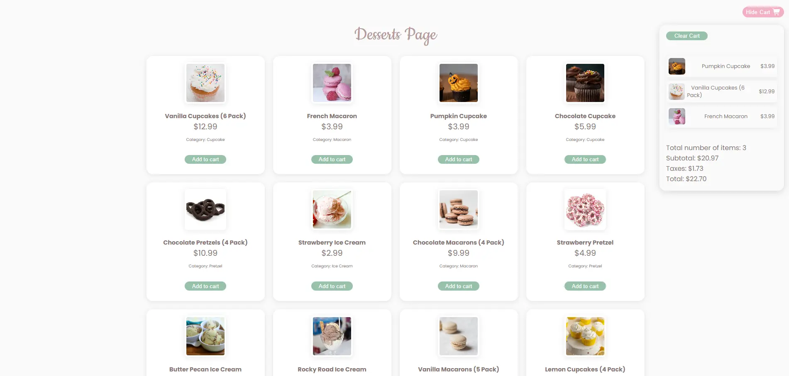
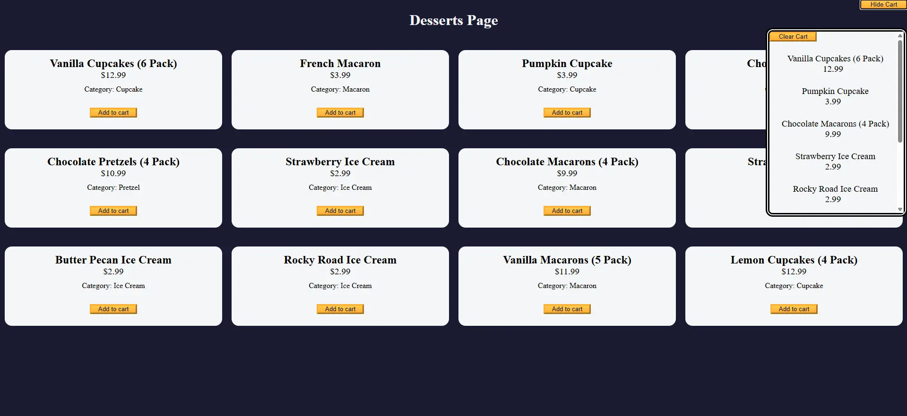

# 🛒 Shopping Cart Project  

This project is part of the **freeCodeCamp JavaScript Algorithms and Data Structures (OOP section)** curriculum.  
It demonstrates how to build a fully functional **shopping cart system** using **JavaScript, HTML, and CSS**, applying **object-oriented programming concepts**.  

## 📸 New Version Preview  



## 📸 First Version Preview  



## 🚀 Features  

- ✅ Display desserts dynamically from a products list  
- ✅ Add items to the cart with quantity tracking  
- ✅ Show subtotal, taxes (8.25%), and total cost  
- ✅ Update cart count in real-time  
- ✅ Clear all items with confirmation  
- ✅ Responsive layout with CSS  

## 🏗️ Tech Stack  

- **HTML5** – Structure of the page  
- **CSS3** – Styling and layout  
- **JavaScript (ES6)** – Logic and OOP with classes  

## 📂 Project Structure  

```
.
├── index.html   # Main page
├── styles.css   # Stylesheet
└── script.js    # Shopping cart logic
```

## ⚙️ How It Works  

- The `products` array stores available desserts with `id`, `name`, `price`, and `category`.  
- Each product is rendered dynamically into a **dessert card** with an "Add to Cart" button.  
- The **ShoppingCart class** manages:  
  - `addItem()` → Adds items and updates product count  
  - `getCounts()` → Returns the number of items in the cart  
  - `clearCart()` → Clears all items with a confirmation  
  - `calculateTaxes()` → Applies an 8.25% tax rate  
  - `calculateTotal()` → Updates subtotal, taxes, and total  
- Event listeners handle adding products, toggling cart visibility, and clearing items.  

## 🖥️ Usage  

1. Open `index.html` in your browser.  
2. Browse the dessert list and click **Add to Cart**.  
3. Open the cart by clicking **Show Cart**.  
4. View totals and clear the cart when needed.  

## 📚 Learning Goals  

This project was built to practice:  
- Classes and object-oriented programming  
- DOM manipulation  
- Event handling  
- Array methods (`find`, `forEach`, `reduce`)  
- Dynamic rendering with `innerHTML`  

---

✨ Built as part of the **[freeCodeCamp](https://www.freecodecamp.org/learn/javascript-algorithms-and-data-structures-v8/learn-basic-oop-by-building-a-shopping-cart/step-60)** curriculum.  
